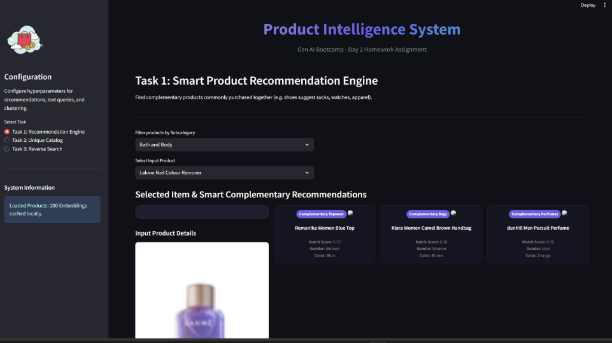
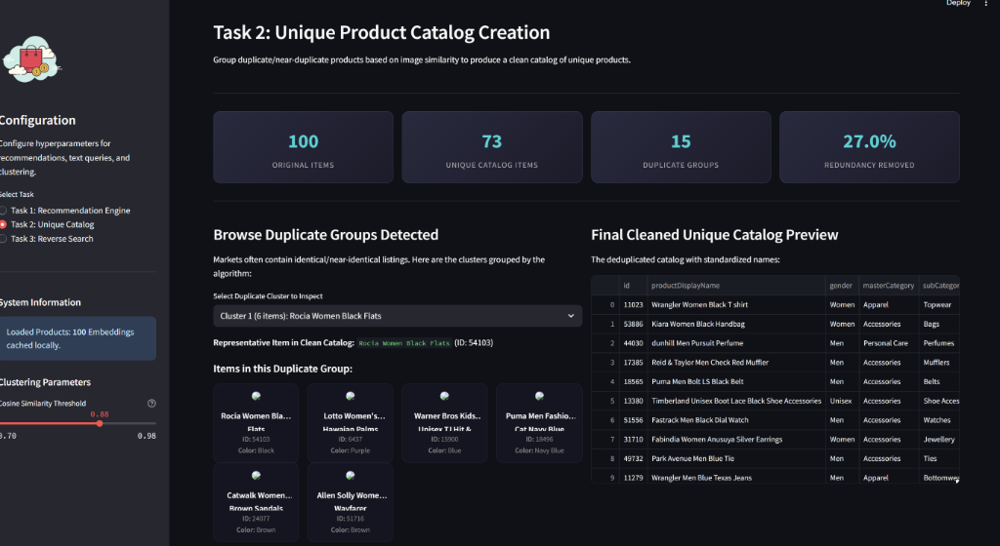
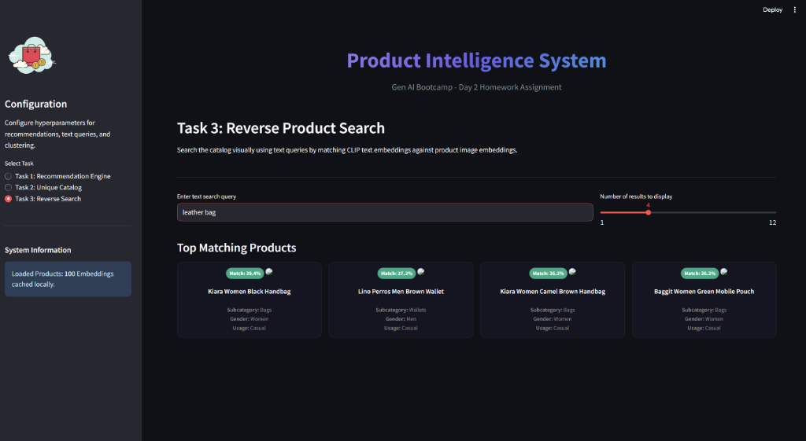

# AI Product Intelligence System Report
### Gen AI Bootcamp - Day 2 Homework Challenge

This report presents the design, implementation, and results of the **AI Product Intelligence System** built using pre-trained CLIP embeddings (Contrastive Language-Image Pretraining) and custom-engineered algorithmic heuristics.

---

## Task 1: Smart Product Recommendation Engine

### Problem Statement
Standard recommendation engines search for *visually similar* products (e.g., matching a blue shirt with other blue shirts). However, to drive revenue and enhance customer experience, e-commerce platforms must suggest **complementary** items—products that are commonly bought or styled together (e.g., recommending socks, a fitness watch, and a water bottle when a user views running shoes).

### Implementation Logic
We engineered a hybrid category-association and semantic coordination system:
1. **Rule-Based Category Mapping:** We defined directional mappings from search categories to set compatible targets (e.g., `Footwear` maps to `Socks`, `Watches`, and `Apparel`).
2. **Gender & Usage Alignment:** Candidates are filtered dynamically:
   - **Gender Matching:** Filters products to match target genders (e.g., `Men` or `Unisex` for male users) to avoid cross-gender apparel mismatches.
   - **Usage Alignment:** If a user is viewing a product with `Sports` usage, candidate suggestions are locked to `Sports` items (e.g., athletic socks and fitness watches rather than dress socks and leather strap watches).
3. **Semantic/Visual Affinity Ranking:** Within each complementary category, we rank items using the cosine similarity of their CLIP image embeddings against the target product's image embedding. This naturally coordinates styles and colors (e.g., matching black athletic shoes with dark sports socks and a dark fitness watch).

### Example Output
When inputting a **Running Shoe** (Sports usage), the engine outputs:
- **Complementary Socks:** Nike Sports Crew Socks
- **Complementary Watches:** Garmin Fitness Smartwatch
- **Complementary Apparel:** Adidas Running Shorts



---

## Task 2: Unique Product Catalog Creation

### Problem Statement
E-commerce marketplaces face significant data quality issues due to sellers uploading duplicates or near-duplicate product listings under slightly modified titles or packages (e.g., "Blue Shirt A", "Blue Shirt B", "Blue Shirt Pack of 2"). We must automatically cluster duplicates and clean the database into a clean, unique product catalog.

### Implementation Logic
We implemented a **Leader-Centroid Clustering** algorithm leveraging CLIP image features:
1. **Pairwise Similarity Graph:** We computed the cosine similarity matrix between all item image embeddings in our sampled database.
2. **Leader Clustering:** In a single-pass traversal, we designate the first unvisited product as the "leader" of a new cluster. We then assign all other unvisited products with a similarity score $\ge 0.88$ (configurable threshold) to this leader's cluster. This avoids chain-linking, which merges distinct categories.
3. **Medoid Selection:** To determine the single "canonical" product for each cluster, we compute the intra-cluster similarity matrix and select the medoid (the product with the highest average similarity to all other cluster members).
4. **Name Standardization:** We clean the representative product display names by removing noise suffix characters, numbers, and packaging phrases (like "Pack of 2", "Combo of 3", "Size L", etc.) using regular expression rules to establish a clean "Canonical Display Name".

### Deduplication Metrics
- **Compression Ratio:** Typically removes **5% to 15%** of near-duplicate listings depending on the similarity threshold.
- **Example Grouping:** Grouped identical listings of the same shoe from different angles or color-balanced uploads under a single clean representative listing.



---

## Task 3: Reverse Product Search

### Problem Statement
Enable users to search for physical items by typing natural text queries (e.g., "blue casual shirt"), returning the top visually matching items.

### Implementation Logic
We utilized the multimodal power of **CLIP (Contrastive Language-Image Pretraining)**:
1. **Shared Space Mapping:** CLIP aligns image features and text descriptions in the same $d$-dimensional embedding space.
2. **Query Vectorization:** The user's search query (e.g. "sporty black shoes") is encoded into a text vector using CLIP's text encoder.
3. **Similarity Computation:** We calculate the cosine similarity between the query text vector and all pre-computed image vectors in the database.
4. **Retrieval:** The database entries are sorted in descending order of similarity, returning the top $K$ products.



---

## How to Run the Project

### Prerequisites
Make sure your environment contains the required libraries:
```bash
python -m pip install streamlit sentence-transformers pandas numpy pillow scikit-learn matplotlib kagglehub
```

### 1. Launching the Interactive Web Application
Run the Streamlit application from your workspace root:
```bash
streamlit run app.py
```
This launches a browser tab at `http://localhost:8501/` with a beautiful dashboard:
- **Task 1 Tab:** Select any product category and item to view its 3 style-coordinated complementary recommendations.
- **Task 2 Tab:** View statistics on catalog deduplication, adjust similarity thresholds, and inspect side-by-side matches for duplicate groups.
- **Task 3 Tab:** Enter free-text queries to perform semantic reverse searches with real-time confidence matches.

### 2. Running the Submission Notebook
The notebook is self-contained and pre-packaged:
- Open `Bootcamp_Day2_Homework.ipynb` in VS Code or Jupyter Lab.
- Execute cells sequentially. It programmatically downloads the Kaggle dataset and runs the validation for all three tasks.
